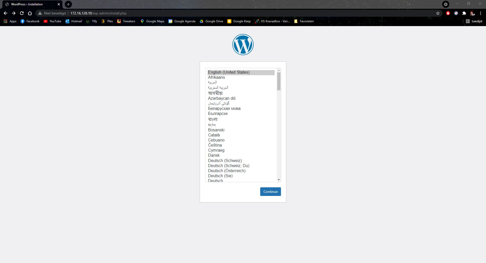
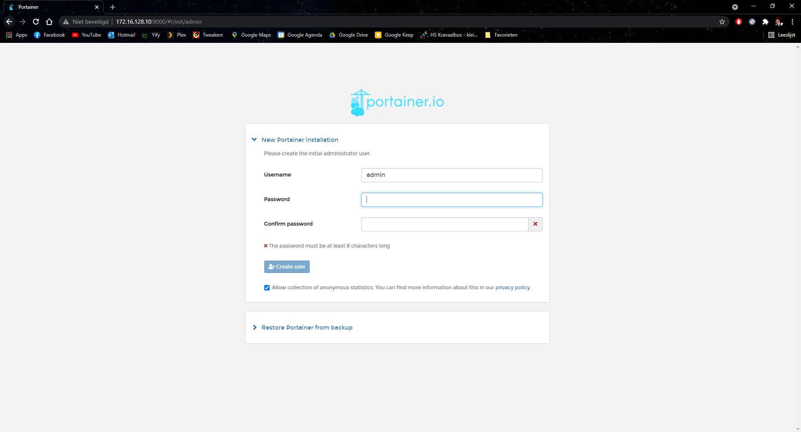

# Enterprise Linux Lab Report

- Student name: Maximiliaan Muylaert
- Github repo: <https://github.com/HoGentTIN/elnx-2021-sme-MaximiliaanM>

---

## Test plan

1. Start host with `vagrant up pr010`
2. Surf to the wordpress webserver with ip address: `172.16.128.10`
   1. The wordpress installation page should be visible
3. Surf to the portainer container monitoring system with ip address and port: `172.16.128.10:9000`
   1. The portainer login page should be visible

---

## Procedure/Documentation

### 1. Add host

Add host `pr010` to the `vagrant-hosts.yml` file.

```yaml
  - name: pr010
    ip: 172.16.128.10
    netmask: 255.255.0.0
```
Create a new file in the `hosts_vars` folder named `pr010.yml`. Insert following code into the file.

```yaml
      # host_vars/pr010.yml
      # Variables visible to pr010
      ---
      #Firewall services
      rhbase_firewall_allow_services:
        - https
        - http

      #SELinux
      rhbase_selinux_state: 'enforcing'
```
### 2. Create docker-compose file & configure containers

Create a new file named `docker-compose.yml` in the folder `files` and insert following code to configure the necessary containers.

```yaml
version: '3.1'
services:
  wordpress:
    image: wordpress
    restart: always
    environment:
      WORDPRESS_DB_HOST: db
      WORDPRESS_DB_USER: exampleuser
      WORDPRESS_DB_PASSWORD: examplepass
      WORDPRESS_DB_NAME: exampledb
    volumes:
      - wordpress:/var/www/html
    ports:
      - 80:80

  db:
    image: mysql:5.7
    restart: always
    environment:
      MYSQL_DATABASE: exampledb
      MYSQL_USER: exampleuser
      MYSQL_PASSWORD: examplepass
      MYSQL_RANDOM_ROOT_PASSWORD: '1'
    volumes:
      - db:/var/lib/mysql

  portainer:
    image: portainer/portainer-ce
    restart: always
    ports:
      - 9000:9000
    command: -H unix:///var/run/docker.sock
    volumes:
      - /var/run/docker.sock:/var/run/docker.sock
      - portainer_data:/data

volumes:
  wordpress:
  db:
  portainer_data:
```
### 3. Install role and add tasks for host `pr010`

Open `site.yml` and add the new host `pr010` to the playbook.

```yaml
- hosts: pr010
  become: true
  roles:
    - bertvv.rh-base
  tasks:
    - name: Installing Docker & Docker Compose
      yum: 
        name: 
          - docker
          - docker-compose
        state: latest
    - name: Starting & enabling Docker
      systemd:
        name: docker
        state: started
        enabled: yes
    - name: Copy docker-compose file to VM
      copy:
        src: files/docker-compose.yml
        dest: /home/vagrant/docker-compose.yml
    - name: Start containers with docker-compose
      shell:
        chdir: /home/vagrant/
        cmd: docker-compose up -d
```
    
---

## Test report

1. Start host with `vagrant up pr010`
2. Surf to the wordpress webserver with ip address: `172.16.128.10`
   1. The wordpress installation page should be visible
   2. 
3. Surf to the portainer container monitoring system with ip address and port: `172.16.128.10:9000`
   1. The portainer login page should be visible
   2. 

---

## Resources
